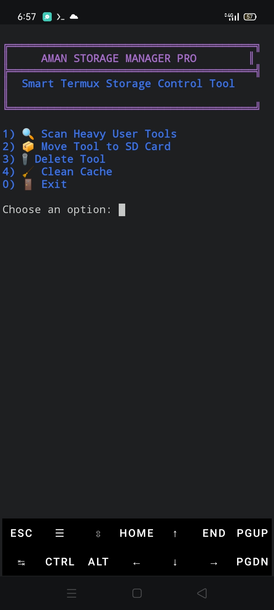
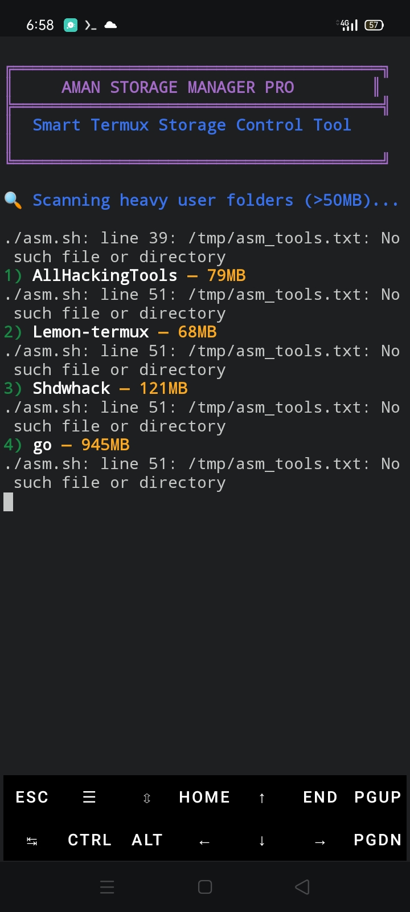
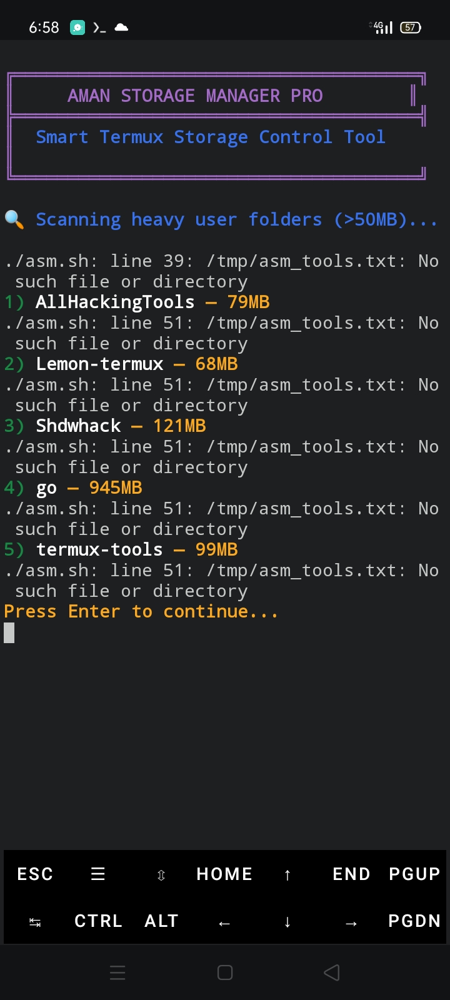

# Aman Storage Manager PRO 🚀


**Advanced Termux Storage Manager Tool**  
Author: Aman (Junoon Khan)  
Email: junoon.khan17@gmail.com

---

## Features
- 🔹 Scan heavy user tools (>50MB)
- 🔹 Move tools to SD Card safely
- 🔹 Delete unwanted tools with confirmation
- 🔹 Clean cache & Python __pycache__
- 🔹 Smart filtering: system folders ignore
- 🔹 Colored & pro CLI interface

---

## 📸 Screenshots





---

## ⚡ Install & Run

```bash
# Clone the repo
git clone https://github.com/YOUR-USERNAME/AmanStorageManager.git
cd AmanStorageManager

# Make script executable
chmod +x asm.sh

# Run
bash asm.sh
